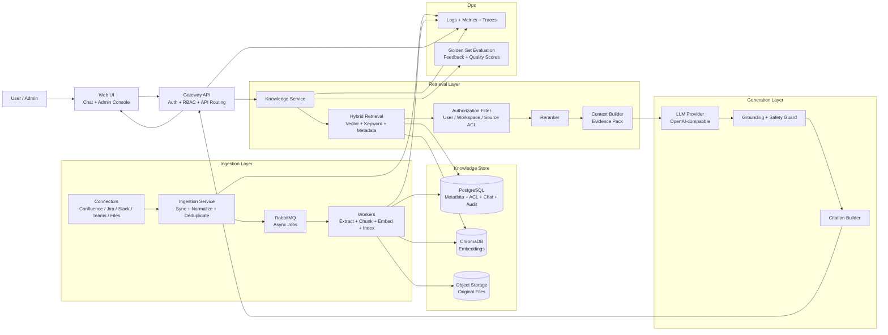

build a **strong Enterprise RAG architecture** like this:



## Recommended architecture

### 1. Web UI

Two main areas:

```text
Chat UI
Admin Console
```

Chat UI handles asking questions, source filters, citations, feedback, and source preview.

Admin Console handles connectors, sync jobs, documents, failures, re-indexing, prompt/provider config, and evaluation.

This matches your FRD’s web-ui requirement.

---

### 2. Gateway API

The gateway should be the single backend entry point for UI.

Responsibilities:

```text
Authentication
RBAC
Session handling
Chat API routing
Admin API routing
Rate limiting hooks
Audit event creation
```

It should not contain heavy RAG logic. Keep it thin.

---

### 3. Ingestion Pipeline

This should be deterministic, not agentic.

```text
Connector Sync
   ↓
Normalize Source Item
   ↓
Detect New / Changed / Deleted
   ↓
Extract Text
   ↓
Chunk
   ↓
Generate Embeddings
   ↓
Store Metadata + Vectors
```

Use RabbitMQ queues:

```text
connector.sync
sourceitem.process
document.chunk
chunk.embed
document.delete
reindex.request
```

This is already aligned with your FRD.

---

### 4. Connectors

Use a shared connector contract:

```text
testConnection()
fullSync()
incrementalSync()
fetchItem()
fetchPermissions()
normalize()
markDeleted()
```

First-class connectors:

```text
Confluence
Jira
Slack
Microsoft Teams
Local/shared folder
Direct upload
```

Your FRD already requires this connector framework.

### Current implementation status (documented deviation)

For the current MVP codebase, the implemented connectors are:

```text
Confluence
Jira
Local/shared folder
```

Deferred to Phase 2:

```text
Slack connector
Microsoft Teams connector
Direct upload connector/API
Explicit normalize() method on shared connector contract
Incremental-sync orchestration (full sync is currently the default reindex path)
```

---

### 5. Storage Design

Use PostgreSQL as the system of record.

```text
PostgreSQL:
- users
- roles
- workspaces
- connector_configs
- connector_runs
- source_items
- documents
- chunks
- chat_sessions
- chat_messages
- feedback
- audit_events
```

Use ChromaDB as the vector index for embeddings.

Use object storage for original uploaded files and extracted raw objects.

---

### 6. Retrieval Pipeline

This is the most important part.

```text
User Question
   ↓
Query Understanding
   ↓
Source / Workspace Filter
   ↓
Hybrid Retrieval
   ↓
ACL Filtering
   ↓
Reranking
   ↓
Context Assembly
   ↓
LLM Answer
   ↓
Citation Packaging
```

Retrieval should combine:

```text
Vector search
Keyword search
Metadata filters
Source filters
Date filters
Workspace filters
Connector-specific filters
```

This matches the FRD’s search and retrieval requirements.

---

### 7. Authorization-Aware RAG

This is critical.

Never do:

```text
Retrieve all → Generate answer → Hide unauthorized citations
```

Instead do:

```text
Retrieve candidates
   ↓
Apply ACL filtering
   ↓
Only authorized chunks go to LLM
```

This prevents data leakage.

---

### 8. Answer Generation

The LLM should receive only:

```text
User question
Conversation summary
Authorized evidence chunks
Citation metadata
Instruction to answer only from evidence
```

Output should include:

```text
Answer
Citations
Source excerpts
Insufficient-evidence response when needed
```

This aligns with the FRD’s answer generation and citation requirements.

---

### 9. Evaluation Layer

Add this from the beginning.

Store:

```text
Golden questions
Expected sources
Retrieved chunks
Generated answer
Citation correctness
User feedback
Latency
Model used
Prompt version
```

This helps you measure whether RAG is actually working.

---

### 10. Observability

Track every stage:

```text
Connector sync duration
Documents indexed
Chunk count
Embedding failures
Retrieval latency
Top-k retrieved chunks
LLM latency
Citation count
Insufficient-answer rate
Feedback score
```

Use:

```text
Micrometer
Prometheus
OpenTelemetry
Structured JSON logs
```

Your FRD already requires these.

## Final recommended service structure

```text
apps/
  web-ui
  gateway-api
  knowledge-service
  ingestion-service

libs/
  connector-core
  connector-confluence
  connector-jira
  connector-slack
  connector-teams
  retrieval-core
  ai-provider-core
  common-models

infra/
  docker
  compose
  db
```

This is a strong RAG architecture: secure, explainable, citation-based, enterprise-ready, and much simpler than MAS.
